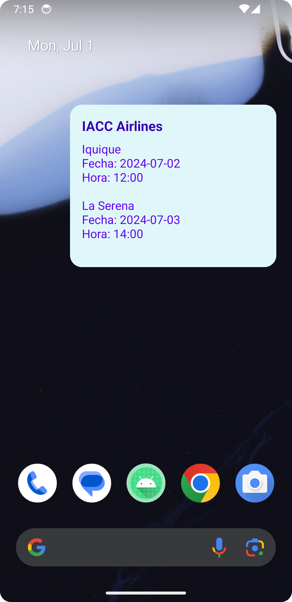
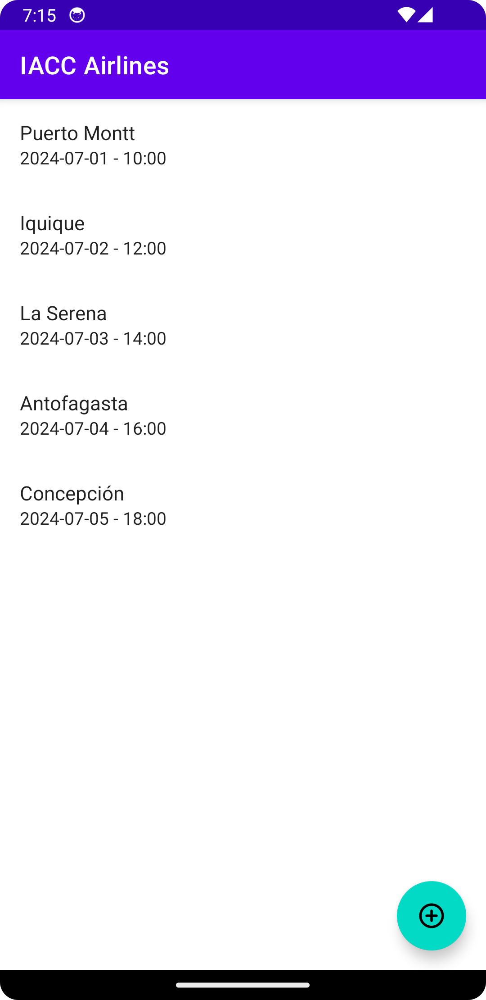
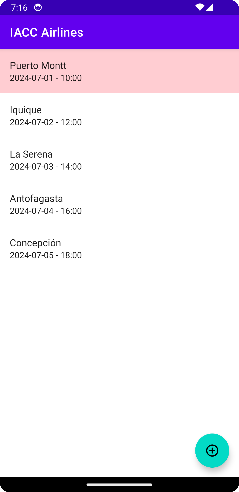
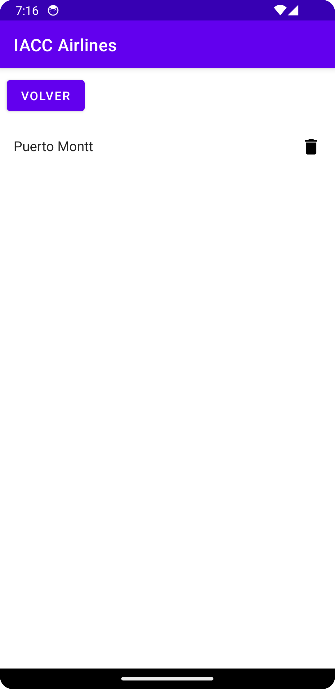
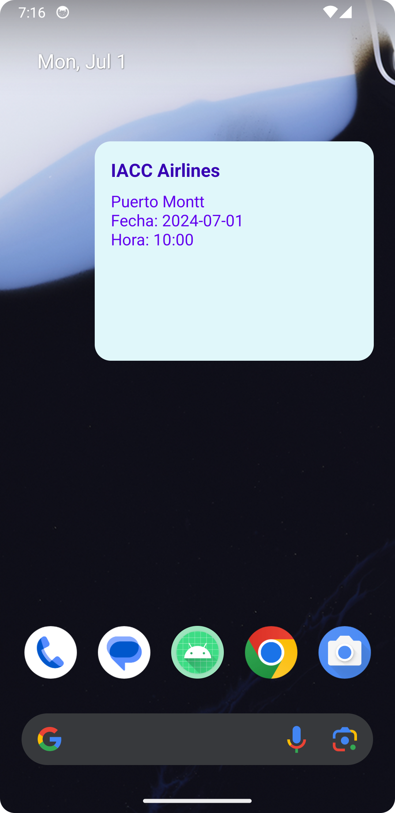

# IACC Airlines App

La aplicación móvil **IACC Airlines App** informa a los clientes sobre nuevas promociones de pasajes aéreos dentro de Chile. Los usuarios pueden ver detalles de los vuelos y realizar reservas directamente desde la aplicación.

## Características

- Listado de ofertas de vuelos con fechas y horarios.
- Posibilidad de reservar vuelos y ver las reservas realizadas.
- Actualización de información de vuelos en un widget.
- Interacción directa con el widget para ver detalles de vuelos.

## Capturas de Pantalla

### Pantalla Principal


### Listado de Ofertas de Vuelos


### Detalles de un Vuelo


### Reservas Realizadas


### Widget en la Pantalla de Inicio


## Instalación

Para clonar y ejecutar esta aplicación, sigue los siguientes pasos:

1. Clona este repositorio:
    ```sh
    git clone https://github.com/aguerov/IACC_Airlines_App.git
    ```
2. Abre el proyecto en Android Studio.
3. Compila y ejecuta la aplicación en un dispositivo o emulador Android.

## Uso

1. Al abrir la aplicación, se muestra un listado de las ofertas de vuelos disponibles.
2. Los usuarios pueden seleccionar un vuelo para ver más detalles y realizar una reserva.
3. Las reservas realizadas se pueden ver y gestionar desde la sección de reservas.
4. El widget en la pantalla de inicio muestra las ofertas de vuelos y permite interactuar para ver más detalles.

## Contribución

Si deseas contribuir a este proyecto, por favor sigue los siguientes pasos:

1. Haz un fork del repositorio.
2. Crea una nueva rama (feature/nueva-característica).
3. Realiza los cambios necesarios y haz commit de tus modificaciones.
4. Haz push a la rama.
5. Abre un Pull Request.

## Licencia

Este proyecto está licenciado bajo la [MIT License](LICENSE).

